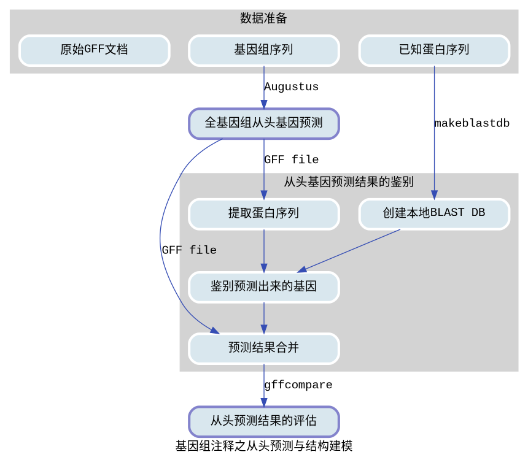

# 1-2 Ab initio prediction and structural modeling of whole genome genes

## Design

```graphviz
digraph flowchart_4 {
    # rankdir=LR;
    fontname="Courier New";
    size="6,5"; ratio = fill;
    node [style="filled,setlinewidth(3)", color="#8383cc", fontname="Courier New", shape="Mrecord",fixedsize=true,width=2.5,fillcolor="#d9e7ee"];
    edge [color="0.635 0.707 0.707", fontname="Courier New"];
    label="基因组注释之从头预测与结构建模";
    # step1[label="数据准备"];
    step2[label="全基因组从头基因预测"];
    # step3[label="从头基因预测结果的鉴别"];
    step4[label="从头预测结果的评估"];

    subgraph cluster_1{
        style=filled;
        color=lightgrey;
        node [color=white];
        label="数据准备"
        sub_c1_1[label="基因组序列"];
        sub_c1_2[label="已知蛋白序列"];
        sub_c1_3[label="原始GFF文档"];
    }

    subgraph cluster_2{
        style=filled;
        color=lightgrey;
        node [color=white];
        label="从头基因预测结果的鉴别"
        sub_c2_1[label="创建本地BLAST DB"];
        sub_c2_2[label="提取蛋白序列"];
        sub_c2_3[label="鉴别预测出来的基因"];
        sub_c2_4[label="预测结果合并"];
    }

    sub_c1_1->step2[label="Augustus"];
    sub_c1_2->sub_c2_1[label="makeblastdb"];
    step2->sub_c2_2[label="GFF file"];
    sub_c2_2->sub_c2_3;
    sub_c2_1->sub_c2_3;
    sub_c2_3->sub_c2_4;
    step2->sub_c2_4[label="GFF file"];
    sub_c2_4->step4[label="gffcompare"];
    # sub_c1_3->step4;
}
```

### Procedures

pass

## Division of tasks

pass