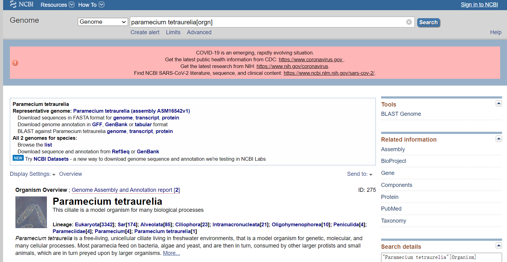
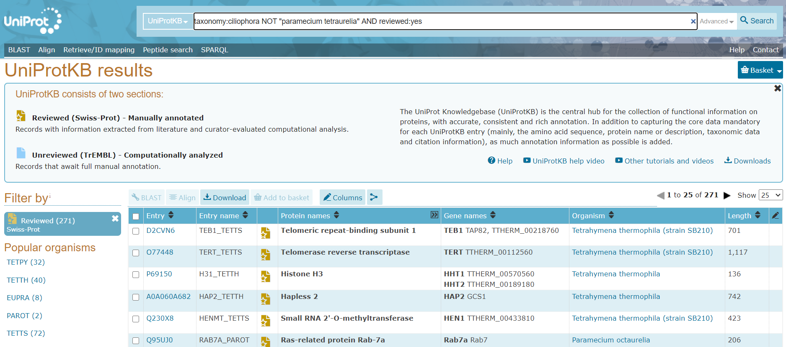

# 实验一: 全基因组基因的从头预测及结构建模

> Ab initio prediction and structural modeling of whole genome genes

* 小组成员：李定洋、裘彧然、朱泽峰、张书凡、郑宇翔
* 组长：朱泽峰

## 实验背景

DNA序列分析是后基因组时代计算生物学的一个重要领域。从上世纪九十年代至今，单单从基因组序列中进行基因结构从头算预测的计算方法在很大程度上促进了研究者对各种生物学问题的理解。虽然这方面的计算预测已经有了不少方法与对应软件，但如何为研究对象(数据)选择合适的方法、数据集下开发的软件，从而做到较为稳健与准确地预测也面临着挑战。

## 选题介绍

本次实验就挖掘多种模式生物基因组中的序列特征及其在基因预测中的应用进行比较性实验。主要目的是对不同的主流预测方法/软件在不同种的模式生物基因组数据集下的预测结果进行校验，并试图阐明区别所在。

## 实验设计

基础流程如下:

### Organism

1. 草履虫(Paramecium tetraurelia) (纤毛虫)
2. 秀丽线虫(Caenorhabditis elegans) (线虫)
3. 酿酒酵母(Saccharomyces cerevisiae) (真菌)

<table>
    <tr>
        <td>
            
        </td>
        <td>
            
        </td>
    </tr>
    <tr>
        <td>
            <b>酿酒酵母(Saccharomyces cerevisiae)</b>是最简单的真核生物之一。其基因组长度为12,157,105(1千万级)个碱基对，包含6692个基因(Ensembl). <a href="https://www.yourgenome.org/facts/why-use-yeast-in-research">More</a>
        </td>
        <td>
            <b>秀丽隐杆线虫(Caenorhabditis elegans)</b>的基因组长度为1亿个碱基对，包含的基因数量与人类相似，约为20500个基因 (Ensembl).<a href="https://www.yourgenome.org/facts/why-use-the-worm-in-research">More</a>
        </td>
    </tr>
    <tr>
        <td>
            
        </td>
    <tr>
    <tr>
        <td>
            <b>草履虫 (Paramecium tetraurelia)</b>具有两种细胞核:微核和大核。大约87Mbp(Ensembl)。
        </td>
    <tr>
</table>

#### Reference

* <https://www.yourgenome.org>
* <https://www.livescience.com/55178-paramecium.html>
* <http://metazoa.ensembl.org/Adineta_vaga/Info/Index>

### 实验可行性分析

* 于数据库初步检索有无对应的数据资源(已完成)
     * `GeneBank`: 裘彧然,张书凡
     * `Ensembl`: 朱泽峰
     * `UniProt`: 郑宇翔
* 调研软件可用度/有无失效
  * 李定洋,张书凡
* 调研文献
  * Huang Y, Chen SY, Deng F. Well-characterized sequence features of eukaryote genomes and implications for ab initio gene prediction. Comput Struct Biotechnol J. 2016;14:298-303. Published 2016 Jul 27. doi:10.1016/j.csbj.2016.07.002

### 正式实验分工

1. 从`GenBank`数据库选择与下载下列物种的基因组序列和注释文档
   * 草履虫(Paramecium tetraurelia) (纤毛虫)
   * 秀丽线虫(Caenorhabditis elegans) (线虫)
   * 酿酒酵母(Saccharomyces cerevisiae) (真菌)
2. `UniprotKB`数据库下载这些物种所在分类的所有已知蛋白(排除该物种自身的已知蛋白)
3. 基因预测软件：安排两人对`Augustus`等软件检索相关的评测比较的文章，并选取若干个工具，安装使用测试，解决软件使用过程中出现的问题
4. 使用上一步选定的多个基因预测软件，对全基因组序列进行基因预测和结构建模，结果转成GFF3格式
5. 利用`gffcompare`比较不同软件的预测结果，进行挑选与整合
   * 解读`gffcompare`结果
   * 两两共同特征的选择: e.g. 局部重合,完全重合
   * 而后进行挑选与整合
6. 将4和5的结果与1下载的原始注释文档进行比对，分析异同，评估优劣，改良
7. 本地blast配置，用blast比对鉴别第4和5步的结果中输出的蛋白质
8. 用`blast92gff3.pl`程序转化blast结果为gff3格式(修改参数)
9. 利用`JBrowse`和`IGV`将注释组的注释信息可视化，比较两者优劣

* `1,2`:张书凡
* `3,4`:裘彧然,郑宇翔
* `5`: 李定洋,朱泽峰
* `6`:朱泽峰,张书凡
* `7,8`:李定洋
* `9`:张书凡

## 实验步骤

### 1 `GenBank`数据库选择与下载选定物种的基因组序列和注释文档

从NCBI的Genome数据库下载草履虫、秀丽线虫、酵母菌的基因组序列和GFF格式的注释信息，下载地址如下：

* 草履虫（Paramecium tetraurelia）：https://www.ncbi.nlm.nih.gov/genome/275
* 秀丽线虫（Caenorhabditis elegans）：https://www.ncbi.nlm.nih.gov/genome/?term=Caenorhabditis+elegans
* 酵母菌（Saccharomyces cerevisiae）：https://www.ncbi.nlm.nih.gov/genome/?term=Saccharomyces+cerevisiae

### 2 `UniprotKB`数据库下载选定物种所在分类的所有已知蛋白

从UniPort数据库下载下面三个物种所在分类的所有已知蛋白（排除该物种自身的已知蛋白质）。草履虫属于纤毛亚门，秀丽线虫属于线虫门，酵母菌属于真菌界。搜索关键词如下：

* 草履虫：`taxonomy:ciliophora NOT "paramecium tetraurelia" AND reviewed:yes`
* 线虫：`taxonomy:nematoda NOT "caenorhabditis elegans" AND reviewed:yes`
* 酵母：`taxonomy:fungi NOT "saccharomyces cerevisiae" AND reviewed:yes`

